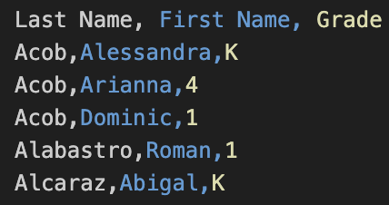
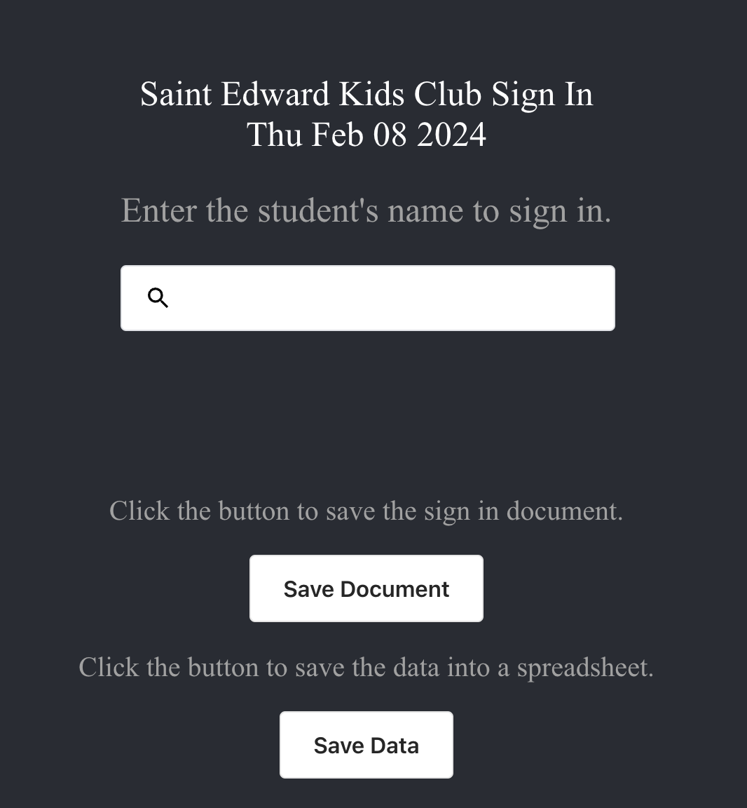
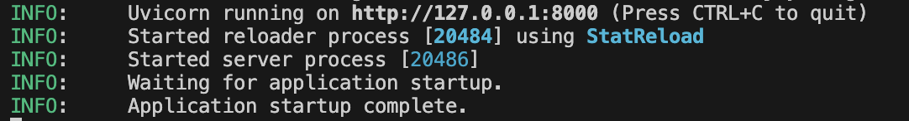

# Kids Club Sign-in/Sign-out 
This program aims to create a sign-out sheet for students who check in to Kids Club for the day.  
The program will use `python-docx` to generate word documents to fetch a list of students who checked in to extended care.  
It also uses `uvicorn` and `FastAPI` for backend functionality and data handling.
# Table of contents
[Important notes](#important-notes)
[Python set up](#python-setup)
[React.JS setup](#react.js-setup)
[Program setup](#program-setup)
# Important notes
- The students database is imported in a CSV format. Please name this file as `students.csv` and store the file in the `~/api` folder where the python files are stored.
An example of the database is shown below.

- A record of each student signed in and signed out is both stored as sign in sheets as well as CSV files.
- The sign in sheets are stored in the folder `signInSheets` under the appropriate month folder.
- The CSV logs are stored in the folder `Logs` under the appropriate month folder.
- If `Logs` and `signInSheets` are not created in the directory, see below on how to create them.

# Python setup
For this program, we will be utilizing a third-party Python library called [python-docx](https://python-docx.readthedocs.io/en/latest/).  
This library allows us to generate Microsoft Word documents from python scripts, which is the goal for this program.

- To install uvicorn, run the command `pip install uvicorn`.
- To install FastAPI, run the command `pip install fastapi`.
- To install python-docx, run the command `pip install python-docx`.

If you do not have pip, install or upgrade [python](https://www.python.org/downloads/) to the latest version.

# React.JS setup
This program also features a frontend aspect using React.JS. We also utilize a React library called `<ReactSearchAutoComplete>`  
that helps with typing in student names.

- To run this with React.JS, we will need to first install [Node.JS](https://nodejs.org/en/download).

# Program setup
1. Once both python and React.JS have been set up, navigate to the directory that the program is stored in.
2. Then, navigate to the `stedcs` folder. This is where the frontend is stored.
3. If `package-lock.json` is in the `stedcs` folder, delete it.
4. Once deleted, navigate to the `stedcs` folder in the terminal/command prompt. This is usually done using the command `cd`.
5. Once in the `stedcs` folder, run the command `npm install react-scripts`.
6. Test to see if the frontend is working with `npm start`.   **Your screen should open a web browser window that looks like this:**  
  

Now, we can start running the backend.  
1. If this is your first time running the program, folders for storing the sign in sheets and the data logs are not created yet.
  In this case, we need to run the file `args.py`. Navigate to the directory that the python files are stored in. (`~/api`)
  Create the folders for Logs and Sign-in Sheets using the command `python folders.py`.
This will generate a folder named `Logs` and `signInSheets`, and these folders also have a folder for each school month. (Ex. Jan-June, August-December)
3. Now, run the command `python server.py`.
4. If ran correctly, this should appear in the terminal/command prompt:

   
