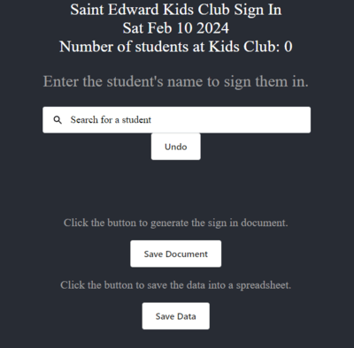
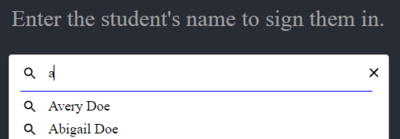
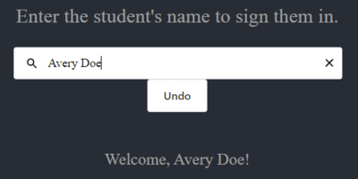
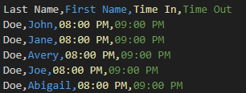

# Kids Club Sign-in/Sign-out 
This program aims to create a sign-out sheet for students who check in to Kids Club for the day.  
The program will use `python-docx` to generate word documents to fetch a list of students who checked in to extended care.  
It also uses `uvicorn` and `FastAPI` for backend functionality and data handling.
# Table of contents
- [Important notes](#important-notes)
- [Python set up](#python-setup)
- [React setup](#react-setup)
- [Program setup](#program-setup)
- [Navigation](#navigation)
# Important notes
- The students database is imported in a CSV format. Please name this file as `students.csv` and store the file in the `~/api` folder where the python files are stored.
An example of the database is shown below.

- A record of each student signed in and signed out is both stored as sign in sheets as well as CSV files.
- The sign in sheets are stored in the folder `signInSheets` under the appropriate month folder.
- The CSV logs are stored in the folder `Logs` under the appropriate month folder.
- If `Logs` and `signInSheets` are not created in the directory, see below on how to create them.

# Python setup
For this program, we will be utilizing a third-party Python library called [python-docx](https://python-docx.readthedocs.io/en/latest/).  
This library allows us to generate Microsoft Word documents from python scripts, which is the goal for this program.

- To install uvicorn, run the command `pip install uvicorn`.
- To install FastAPI, run the command `pip install fastapi`.
- To install python-docx, run the command `pip install python-docx`.

If you do not have pip, install or upgrade [python](https://www.python.org/downloads/) to the latest version.

# React setup
This program also features a frontend aspect using React.JS. We also utilize a React library called `<ReactSearchAutoComplete>`  
that helps with typing in student names.

- To run this with React.JS, we will need to first install [Node.JS](https://nodejs.org/en/download).

# Program setup
1. Once both python and React.JS have been set up, navigate to the directory that the program is stored in.
2. Then, navigate to the `stedcs` folder. This is where the frontend is stored.
3. If `package-lock.json` is in the `stedcs` folder, delete it.
4. Once deleted, navigate to the `stedcs` folder in the terminal/command prompt. This is usually done using the command `cd`.
5. Once in the `stedcs` folder, run the command `npm install`.
6. Test to see if the frontend is working with `npm start`.   **Your screen should open a web browser window that looks like this:**  
  

Now, we can start running the backend.  
1. If this is your first time running the program, folders for storing the sign in sheets and the data logs are not created yet.
  In this case, we need to run the file `folders.py`. Navigate to the directory that the python files are stored in. (`~/api`)
  Create the folders for Logs and Sign-in Sheets using the command `python folders.py`.
This will generate a folder named `Logs` and `signInSheets`, and these folders also have a folder for each school month. (Ex. Jan-June, August-December)
2. Now, run the command `python server.py`.
3. If ran correctly, this should appear in the terminal/command prompt:

  Now that both the frontend and the backend are functioning, we can start using the program.

# Navigation
- To sign in a student, start typing in their name and the search bar should autocomplete. If no student shows up, it is likely that the student is not in database.
Typing in a student who exists in the database should show up like this: 

   **Click on the name of the student you would like to check in, then press enter. A message should appear welcoming the student.**  

  Trying to sign in the student again will prompt a message saying the student has already checked in.
- Continue this process until all students are signed in for the day. At Kids Club, all students are usually signed in before 3:30.
- Once all students are signed in, press the `Save Document` button to generate a sign-in sheet for that day. The file is stored under `/Logs/[month]` with the name `mmmddstudents.docx`, Ex. `Feb08students.docx`. You can now print the sign-out document that contains all the students' names who've signed in.
- A message should appear above the `Save Document` button saying the document has been saved, and the message above the search bar should have changed to sign out.
     
- Now students can be signed out. Any students who come in after 3:30 can still be signed in at this time. To sign out a student, repeat the same process as signing in the student.
- A message should appear saying the student has sucessfully signed out.
- A message also appears if you try to sign out the student again. ***NOTE: If trying to sign in or sign out the same student, the earliest time the student has signed in/signed out will be recorded.***
- At the end of the day once all students are signed out, save the data into a CSV file using the save data button. A message will appear above the button saying that data has been successfully saved.
Examples of formatting for the sign-in sheet and data file are shown below. 

